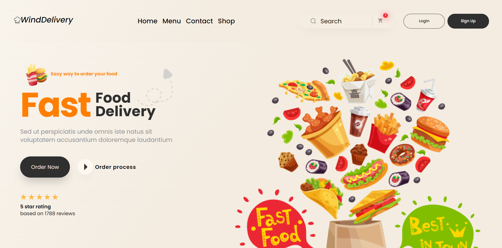

# FastFoodDelivery

# Lading Page

Projeto com intuito de aprender html e css.
https://github.com/PaoFrito/FastFoodDelivery

## Veja o desenvolvimento do projeto:

## 🤝 Contribuição

Projeto aberto para ajuda!

Lembre de seguir os requisitos da licensa...

## 🔖 Licensa

## 💰 Donate
PIX: henriqueamaralhp@gmail.com (email)

## 😎 Como rodar

 `git clone https://github.com/PaoFrito/FastFoodDelivery`
- Abra o arquivo index.html

Copyright © 2022 Henrique
